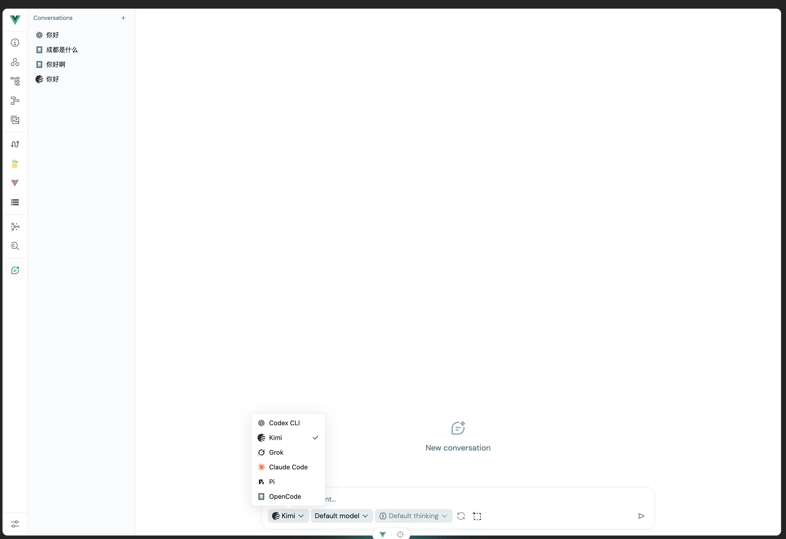

# Vue DevTools ACP

## Discussion prototype

This branch is a work-in-progress prototype for maintainer feedback, not a
merge-ready or published package. See the [feature proposal](../../ACP_FEATURE_PROPOSAL.md)
for scope, security requirements, and questions about upstream integration.



Local validation on 2026-09-08:

- Package build and TypeScript/Vue type checks passed.
- The playground table and configuration tests passed (10 tests).
- Scoped ESLint checks passed with two existing multiple-component warnings in
  the UI preview fixture.
- The 173-test ACP suite passed once. A subsequent run failed two tests:
  history reload changed assistant message timestamps by 1 ms, and a persistence
  lock error surfaced as an agent-process exit error. These inconsistent results
  need investigation before an upstream PR; the suite is not reliably green.
- Live model calls and cross-platform behavior were not revalidated for this
  snapshot. Fixture success does not establish live-provider compatibility.

The screenshot and prototype source are shared for discussion. Local agent
session data and generated build outputs are excluded from the commit.

## Codex CLI and DeepSeek

Codex CLI is now available alongside the five existing agents. Its child process
always uses an isolated CODEX_HOME at ~/.vue-devtools/codex, or the explicit
VUE_DEVTOOLS_CODEX_HOME override. It never inherits the desktop CODEX_HOME.
Existing ~/.codex settings and desktop authentication are not modified.

Place config.toml and models.json in that isolated directory, following the
DeepSeek Responses integration documentation. The provider base URL is
https://api.deepseek.com and wire_api is responses. Secrets stay in the local
configuration, not in the repository or browser. Model names come from the
configured endpoint's /models API; effort choices come from the matching model
metadata. The driver accepts text only, even if a vision model is listed.

The installed Codex version uses on-request approval with workspace-write
sandboxing. This does not request confirmation for every in-workspace action;
approval requests raised by Codex are forwarded to the UI. Private reasoning
notifications are not rendered. Unknown reverse requests are rejected.

Run pnpm --filter @vue/devtools-acp test:live codex to explicitly test a real
DeepSeek conversation, restoration, cancellation, and continuation. This consumes
API quota and retains native test history only in the isolated CLI home.

To use the same isolated configuration manually:

    CODEX_HOME=~/.vue-devtools/codex OCX_SHIM_BYPASS=1 codex

The normal codex command without these variables remains unchanged.

Private workspace package for local agent integration.

## Contracts

`src/schema` defines our browser-safe TypeScript contracts, following the
separation of session records, native provider cursors, drivers, and transport
used by Waku. These are independently written contracts, not a copy of Waku's
implementation or a wire-compatible implementation of its protocol.

- `provider.ts`: provider discovery, capabilities, and native resume cursors.
- `session.ts`: persisted session metadata, display history, and transient targets.
- `message.ts`: visible messages, tool activity, permissions, and user questions.
- `events.ts`: driver events and sequenced replay envelopes.
- `driver.ts`: service-side driver interface, not browser RPC.
- `protocol.ts`: versioned browser/service requests, responses, and handshake.

One session belongs to one provider. After the first message its provider must
not change. Drivers own native protocol translation and restoration; display
history is not a substitute for provider context. A null cursor means the native
session has not yet been established. Capability flags must be discovered, not
inferred from the provider list. No provider is connected by these declarations.

Timestamps use Unix milliseconds. The service must validate incoming messages,
authenticate clients, enforce provider locking and permission policy, and reject
stale runtime/epoch identifiers. Request IDs identify retries of the same logical
request. Replay is scoped to session, runtime, and service epoch; clients must
reload history when replay is unavailable. Transient DevTools targets require
revalidation after reconnect. Do not persist authentication tokens in history.

These are compile-time types, not JSON Schema or runtime validators. Provider
SDK schemas and runtime validation will be added with the respective drivers.

## Browser UI

`src/ui` owns ACP components, composables, authentication, session lifecycle,
composer behavior, styles, and agent icons. `@vue/devtools-acp/ui` exports
`AcpPanel`, `AcpChat`, and `createAcpTransport`. This private workspace entry
ships Vue/TypeScript source for the consuming Vite application to compile.
The root entry remains type-only; the Node entry never imports the UI.

`packages/client/src/pages/acp.vue` only supplies the DevTools theme and maps
host RPC methods to `createAcpTransport`. ACP does not import client or core
internals. The host's UnoCSS config merges `@vue/devtools-acp/ui/uno` for ACP
source scanning and icons; its existing DevTools UI theme supplies design tokens.

UI tests and fixture previews live in `tests/ui`. Run
`pnpm --filter @vue/devtools-acp test:ui` or start
`pnpm --filter @vue/devtools-acp dev:ui` and open `/tests/ui/preview.html`.
The package's `test` command covers both Node and UI tests. See
`src/ui/README.md` for chat behavior and opt-in browser checks.

Build with `pnpm --filter @vue/devtools-acp build`. The workspace `dev` command
also picks up this package's `stub` task.

Run `pnpm --filter @vue/devtools-acp type-check` for positive and negative
compile-time contract tests and Vue UI checks. The root entry remains type-only.

## Local agent drivers

The Node entry exports `startAgentDriver(options, onEvent)` and
`openAgentSession({ projectRoot, sessionId, onEvent })`. The latter opens an
existing store record and persists the native cursor and display snapshots.
Neither API modifies CLI credentials or installs CLI tools.

| Provider | Native transport                                      |
| -------- | ----------------------------------------------------- |
| kimi     | kimi acp, official ACP TypeScript SDK                 |
| grok     | grok agent --no-leader stdio, same ACP driver         |
| claude   | Persistent CLI stream-json and stdio control requests |
| pi       | pi --mode rpc, LF-delimited JSON                      |
| openCode | Project-pooled authenticated loopback HTTP/SSE server |

Other reserved schema provider IDs are not implemented. Unsupported
providers fail before spawning. Transport selection follows Waku, but the
implementation is independently written and is not Waku wire-compatible.

CLI commands resolve from PATH. Optional binaryPath overrides and cwd must be
absolute. A null model preserves the installed CLI's default model. No API keys
belong in this package. Only text prompts are currently accepted.

Call prompt with turnId, messageId, and content. It submits the turn; completion
is reported by turnFinished. Cancel interrupts the turn; close releases owned
processes without deleting native history. Always close runtimes in finally.
Model changes either apply (Pi model/effort) or return restartRequired; callers
must close and restore for the latter. Live provider cursors cannot be swapped
between providers. Restored history is not appended to the display log again.

Permissions require explicit responses; questions use respondUserInput for
Claude/OpenCode. ACP question fallbacks use the agent's permission options. ACP
filesystem/terminal reverse RPC is not advertised. Pi enables only read, grep,
find, and ls, with extensions/context discovery disabled and skills enabled. This is not an
OS filesystem sandbox. Claude hooks and external MCP discovery, and OpenCode
external plugins, are disabled for managed processes without changing files.

Text deltas are buffered until the turn ends; a host crash can lose unfinished
text. Metadata and event files are not one transaction. The coordinator shares
one store per project within this process; cross-process ownership of live
Agent sessions is not implemented. Native protocol parsing is intentionally
limited to supported events; only the ACP transport uses SDK schema validation.

Verified on macOS with Node 22/24. Windows descendant cleanup is not verified.
Automatic OpenCode SSE reconnection, paginated history import, attachment input,
MCP forwarding and network replay are outside this implementation.

### Driver verification

Unit tests use subprocess and authenticated HTTP/SSE fixtures; they do not call
models. Live tests use installed CLIs and can incur model usage:

```sh
pnpm --filter @vue/devtools-acp test
pnpm --filter @vue/devtools-acp test:live
pnpm --filter @vue/devtools-acp test:live kimi grok
```

Each live test creates a temporary project, sends a random marker through the
package's native driver, persists the cursor, restores and recalls the marker,
cancels a turn, then continues. Approval requests are denied. Temporary projects
and owned processes are cleaned; native CLI test histories are retained.

## Composer Completion

The chat composer supports leading slash commands and workspace file mentions.
Suggestions use authenticated getAgentCommands/getAgentFiles Vite RPC calls.
No arbitrary working directory, executable, template, or skill path is accepted
from the browser. File mentions carry relative paths and source ranges; the
service revalidates them before submission and adds path context, not contents.
References persist alongside the original user message. Expanded/native inputs
are separate from display history. Unsupported commands fail explicitly.

Codex skills use the isolated app-server skills/list catalog and structured skill
inputs. Claude uses initialization metadata, Pi uses get_commands with only
skills enabled, and OpenCode uses the managed pure server's command registry and
native command endpoint (including registered skills). Providers expand their
own prompt templates. Local Claude files only annotate already-reported entries;
the client never assumes that an arbitrary SKILL.md is executable.

Kimi and Grok publish ACP available_commands_update after the first real session
is created. They are not started by completion queries. Other catalog probes do
not send model turns or create native conversations. Hooks remain disabled for
Claude; no hooks management UI is included. The local /new command never reaches
an agent. Enter/Tab accept suggestions, Escape dismisses, and IME input is guarded.

Verification: composer.test.ts covers the six native fixtures, discovery,
references, isolation and invalid requests; the UI completion/chat tests cover
keyboard interaction, edits, async races and session drafts. composer-browser.ts
is an opt-in Playwright check of desktop/mobile and light/dark preview layouts.
Set PLAYWRIGHT_MODULE and optionally COMPOSER_PREVIEW_URL when running it.

Real catalog probes were verified locally for Codex, Claude, Pi and OpenCode;
Kimi/Grok live catalog discovery and real model-driven skill execution still
require an explicit live conversation. Fixture success does not establish those
live-provider behaviors.

## Project Session Storage

The Node-only `@vue/devtools-acp/node` entry exports
`createSessionStore({ projectRoot })`. Pass an absolute, trusted server-side
project root, as the Vite RPC integration does. The root export remains
type-only. The store creates `.vue-devtools/agent/sessions/<uuid>/` on first
session creation, with versioned `session.json` metadata and `events.jsonl`.

Methods: `create`, `list`, `get`, `updateMetadata`, `appendEvent`, `readEvents`.
Missing sessions reject; listing an uninitialized store returns an empty array.
Provider changes are allowed only before native session creation and history.
Storage events are message or turn snapshots (including tool activity), not
network packets. Repeated snapshot IDs are updates for a future UI projector.
Metadata updates are explicit: appending an event does not update status, title,
or recency, and no transaction spans the metadata and event files.

Disk event sequences start at one and continue across restarts independently
of network replay epochs. Complete newline-terminated records are validated.
`readEvents` reports `incompleteTail` without modifying the log. The next append
discards only that uncommitted tail under the writer lock. A malformed complete
line or sequence mismatch rejects both reads and writes without skipping data.

Each store serializes writes. An atomic project lock rejects competing store
instances/processes. After a crash, reads still work but writes refuse a stale
`.write-lock`; an operator must confirm all writers have stopped before removing
that directory. Interrupted `.create-*` staging directories and metadata `.tmp`
files are not committed sessions and may be cleaned only after that same check.
Normal operations clean their own staging files. Files are synced before commit;
power-loss durability of directory entries is filesystem-dependent.

Existing symlink/hardlink storage paths are rejected. This is not a sandbox
against another process maliciously changing filesystem paths during an operation.
New directories/files use owner-only permissions where supported. Add
`.vue-devtools/` to the consuming project's Git ignore rules; this library does
not edit them. Do not store credentials or raw provider protocol packets.

Run `pnpm --filter @vue/devtools-acp test` for filesystem tests. Tests use and
remove isolated temporary projects, never the working project's session history.
